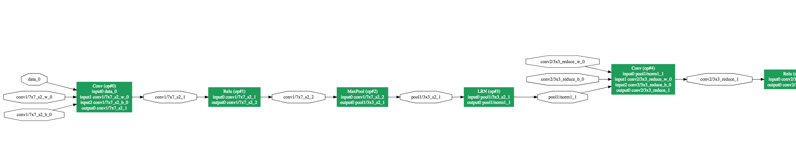
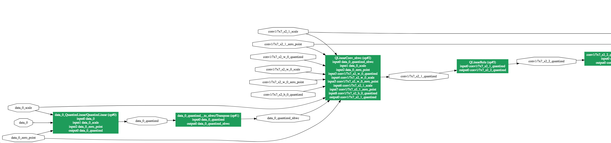

# Quantizer Script

## Overview

For a general overview on the quantizer script first read the quantization.py [README](/systolic_runner/quantization/README.md)

In short, the quantization script converts a floating point model into one where compatible operators have been replaced
by int8 quantized equivalents.

While the majority of the process is identical to Microsoft's original script, a few Systolic specific transformations have been added which will be detailed below. Unless otherwise specified all transformations specified below only apply when quantizing to int8 (not uint8 – which Microsoft's original quantizer was limited to).

## Calibration script

The calibration script is responsible for running the floating point ONNX model and determining quantization parameters for every node.
Under dynamic quantization, compouted parameters are limited to Conv and Matmul nodes; the rest are computed dynamically at runtime (see dynamic quantization in the quantizaiton README).

To run the calibration script, you need to supply it with an input dataset. The format for `dataset_path` is like that of a model downloaded from the model zoo. That is, it should be a folder containing the folders `test_data_set_0`, `test_data_set_1`, etc. where each test data set folder contains the files `input_0.pb`  `output_0.pb` (if there are multiple inputs, have `input_1.pb`, `input_2.pb` etc.)

You can generate these input files via python script in the doc [here](../rcnn_runner#quantization)
I recommend doing the preprocessing as part of the input pb generation so that you can just run the calibration with `--preprocess=None`

## Quantizer 

The quantizer goes through each node in the original ONNX proto, converting nodes to their quantized equivalents.

Currently the following nodes are handled

* Conv: Converted to a QLinearConv

* Matmul: Converted to a QLinearMatmul

* Relu: When quantizing to uint8 Relu is removed entirely. When quantizing to int8, if the input to Relu is already quantized we output a custom-typed QLinearRelu node that onnxruntime internally fuses with a QLinearConv/QLinearMatmul. Note that QLinearRelu is a non-standard type.

We keep track of and propagate the quantization status of every edge in the graph, so given any input to a node we can determine whether it is already in int8 or not. If the input is floating point but the node can be converted to a quantized equivalent, we insert a QuantizeLinear node with the parameters from the output of the calibration script for that layer. If the input is quantized but the operator has no quantized equivalent, we insert a DequantizeLinear node.

Whenever we update a node to be quantized, we also quantize its weights and update the initializer in the ONNX proto. Similarly, the input scale/zero point information is also added to the initializer proto.

## QLinearRelu outputs

Because ONNX lacks a Relu capable of handled quantized types, we insert our own custom QLinearRelu node. We avoid the need to maintain quantization scale into and out of QLinearRelu by ensuring that when we calculate quantization parameters for a node followed by a Relu, we clip `rmin` before calculating the scale for that node. Since the range is already reduced to ensure optimal fit, a subsequent Relu node can simply perform a standard element-wise operation without having to rescale values.

Note that while the QLinearRelu insertion *could* be done in an onnxruntime pass similar to NHWC insertion, we would lack information on the scale of the output from the Relu if there was no QuantizeLinear node immediately following the Relu. As such, we would have rely on the scale of the input to the DequantizeLinear before the Relu as an estimate, which might not necessarily be correct if the scale values were not calculated accounting for this as described in the previous paragraph. (Especially if the distribution of the inputs is heavily skewed negative). Thus, to ensure accuracy it's better to perform this in the quantizer script where we have access to the outputs of each layer.

TODO: Implement the node fusion (at the systolic provider level) for the case of QLinearConv + Dequantize + Relu + Requantize

This should at least most of the cases (e.g. Mobilenet) and will be useful for models exported from Pytorch

## Example

Consider the following snippet from the grpah of Googlenet:

After running the quantization script the model is transformed to:

